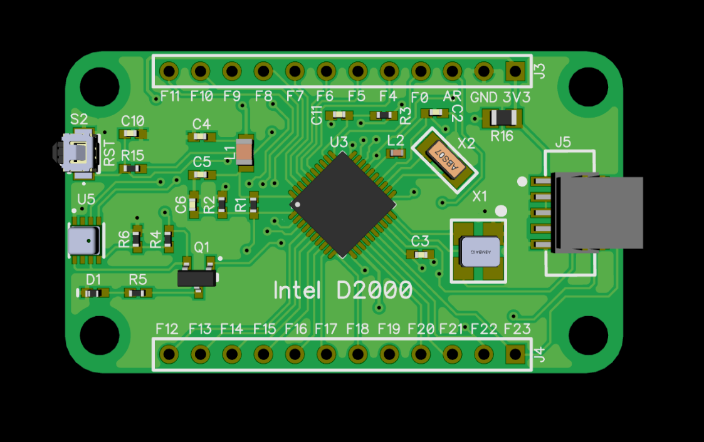
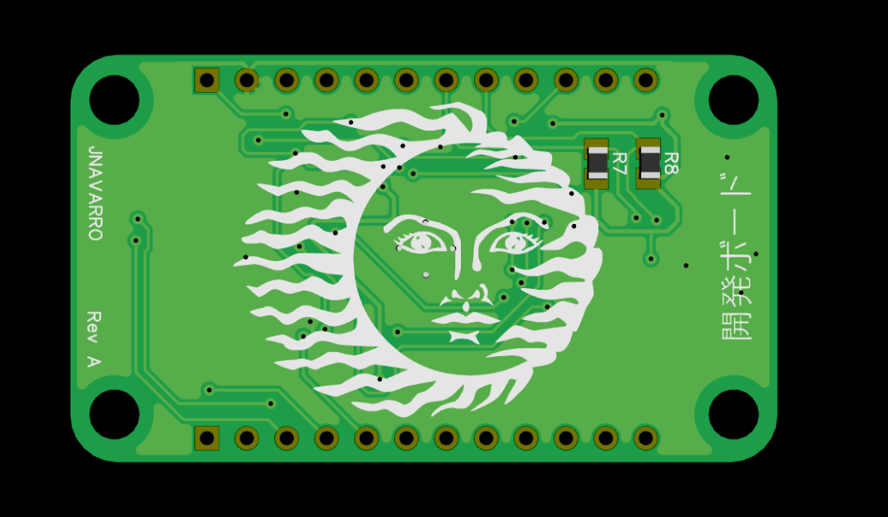
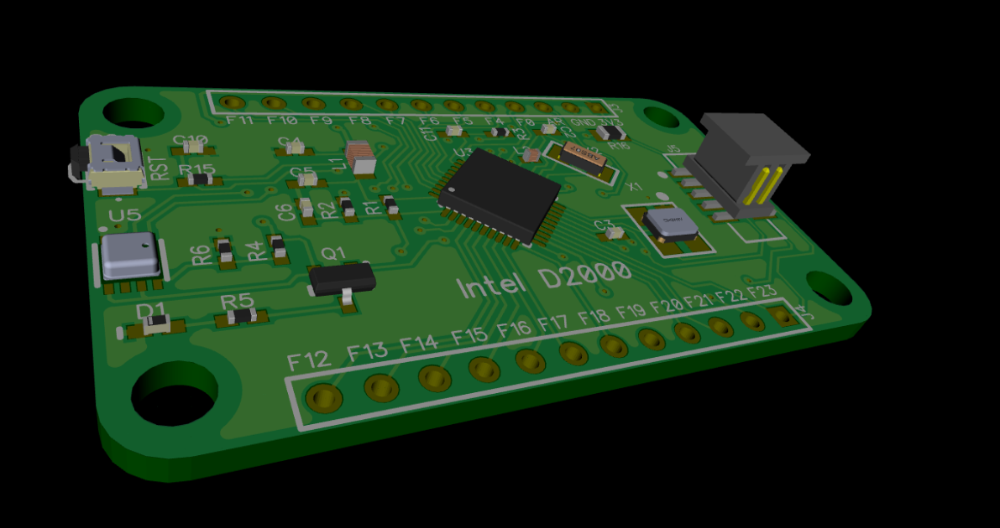
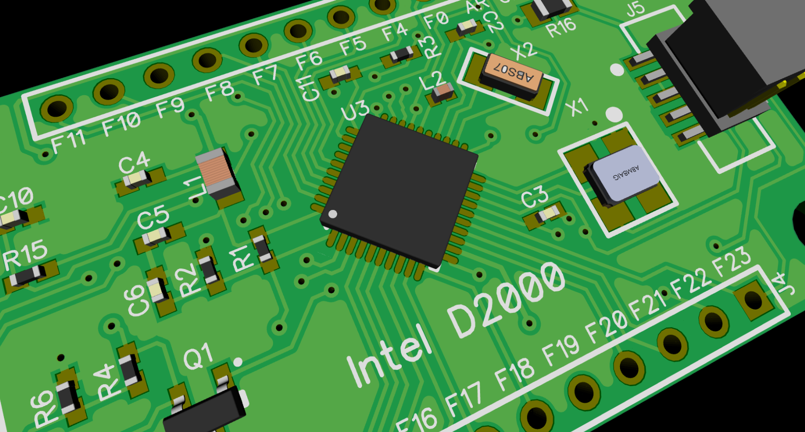

# intel-d2000-develpment-board
 Intel D2000 MCU development board

# Description
Development board based on the now discontinued Intel D2000 x86 MCU. 

JTAG programming header exposed on J5.

U5 Bosch BME280 environmental sensor

 
 
 
 